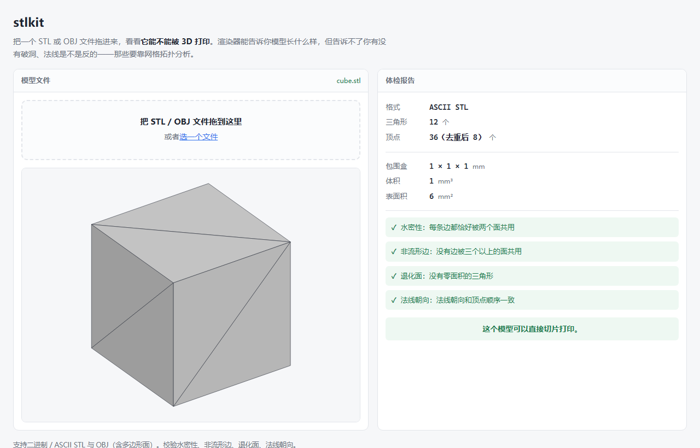
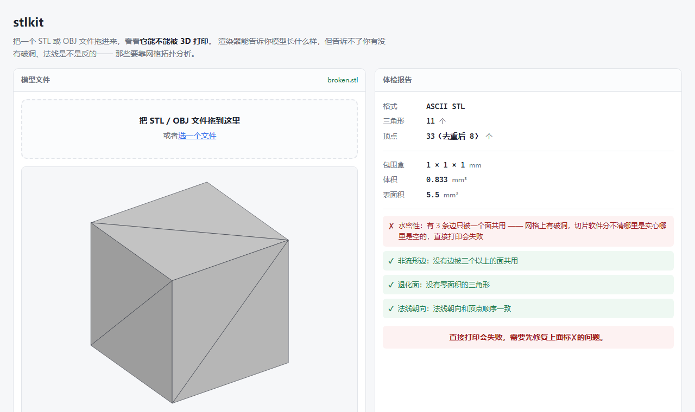

# stlkit

用 MoonBit 写的 STL / OBJ 三维网格工具链。回答一个问题：**这个模型能不能 3D 打印。**



## 为什么需要它

3D 打印失败，最常见的原因不是打印机，是**模型本身有问题**：

| 网格的问题 | 打印时会发生什么 |
| --- | --- |
| 不水密（有破洞） | 切片软件分不清哪是实心哪是空的，算出来的填充是错的 |
| 有非流形边（一条边被三个以上的面共用） | 切片软件不知道该往哪一侧填材料 |
| 有退化面（三个点共线） | 算出零面积的层，产生碎片 |
| 法线朝向反了 | 有的工具会把内外面画颠倒 |

**渲染器能告诉你模型长什么样，但告诉不了你有没有破洞。** 那要靠网格拓扑分析——数清楚每条边被几个面共用。这个工具就是干这件事的。

而且这些问题肉眼看不出来：一个缺了一个三角形的立方体，看上去还是完完整整一个立方体，但它的体积已经从 1 变成 0.833 了——因为体积是靠各面的有符号体积正负抵消算出来的，有破洞就抵消不干净。



## 能做什么

```
解析    STL（ASCII + 二进制两种形态）、OBJ（含多边形面与负数编号）
校验    水密性、非流形边、退化面、法线朝向
分析    体积、表面积、包围盒、尺寸、三角形数与去重顶点数
预览    等轴测 SVG 图（自带背面剔除与明暗）
形态    库 + 命令行 + 网页
```

## 用法

### 网页

拖一个 STL 或 OBJ 文件进页面，左边出预览图，右边出体检报告。**全程在浏览器里完成，文件不会上传到任何地方。**

页面上的分析逻辑不是 JavaScript 重写的，而是同一份 MoonBit 代码经 `moon build --target js` 编译出来的。

### 命令行

```bash
# 出一份体检报告
moon run cmd/main examples/cube.stl

# 顺便导出预览图
moon run cmd/main examples/cube.stl --svg cube.svg

# 不带参数打印帮助
moon run cmd/main
```

输出长这样：

```text
examples/broken.stl
  格式      ASCII STL
  三角形    11 个
  顶点      33 个（去重后 8 个）
  包围盒    1 × 1 × 1 mm
  体积      1 mm³
  表面积    5.5 mm²

  ✗ 不是水密网格 —— 有 3 条边只被一个面共用
    网格上有破洞，切片软件分不清哪里是实心哪里是空的，直接打印会失败

  结论：直接打印会失败，需要先修复
```

把错误写清楚是刻意的：看到「有 3 条边界边」的人不知道这意味着什么，看到「切片软件分不清哪里是实心哪里是空的」才知道要修。

### 库

```moonbit
let data = @fs.read_file_to_bytes("model.stl")
let mesh = match @stlkit.parse_mesh(data) {
  Ok(mesh) => mesh
  Err(msg) => { println("读不了：\{msg}"); return }
}
let check = @stlkit.validate_default(mesh)
if check.is_watertight() {
  println("可以打印，体积 \{mesh.volume()} mm³")
} else {
  println("有 \{check.boundary_edge_count} 条边界边，需要先修复")
}
```

## 实现上的几个决定

**坐标一律用 `Double`，即使 STL 二进制里存的是 32 位浮点。** 体积求和是几十万项累加，用 32 位会在累加过程里越飘越远。读进来就转双精度，误差只剩原始数据本身的。

**解析阶段不做顶点去重。** STL 每个三角形都把自己的三个顶点重写一遍，一个立方体的 8 个顶点会写 36 遍。但「文件里有多少重复顶点」本身就是一条要报告的校验信息，而且浮点去重涉及「多少算同一个点」的容差问题，不该混进解析。

**格式判断靠内容不靠扩展名。** 从别处拷来的文件经常带着错的扩展名，而且二进制 STL 根本没有可靠的文本特征。做法是先按二进制试——从第 80 字节读三角形数量，如果 `84 + 数量 × 50` 正好等于文件长度，那就是二进制；对不上再按文本关键字找。

**顶点焊接按容差量化坐标。** 这是「两个顶点算不算同一个点」的答案：把每个坐标除以容差（默认 1e-6 毫米，也就是 1 纳米）再四舍五入，落在同一格的就算同一个点。这样把浮点比较换成整数比较，避开「0.1 + 0.2 != 0.3」这类问题。1 纳米的容差能盖住 32 位浮点的重复顶点误差，又远小于任何有意义的建模特征（打印机精度是 0.1 毫米量级）。

**预览用画家算法，不是 Z-buffer。** 每个三角形投影到屏幕，按离眼睛的远近排序，远的先画近的后画。对凸的、不怎么自遮挡的模型够用——3D 打印模型基本都属于这类。真正准确的消隐要上光栅化，对这个项目是杀鸡用牛刀。

**法线一律自己算，不用文件里写的。** 很多导出器写的法线是错的甚至直接填 `0 0 0`。校验时会拿文件里的和按顶点顺序算出来的比，不一致就报出来；但渲染和分析时一律用自己算的。

## 开发

仓库根目录就是 MoonBit 模块根：

```bash
moon test            # 跑测试
moon run cmd/main    # 不带参数会打印帮助
bash web/build.sh    # 重新编译网页用的 JS
```

网页部分由 GitHub Actions 自动发布，见 [`.github/workflows/pages.yml`](.github/workflows/pages.yml)。

### 测试

实测结果：

```text
Total tests: 62, passed: 62, failed: 0.
```

`moon check --target all --deny-warn` 零警告。

测试的手法统一是「**拿一个正确的立方体，故意弄坏它，看能不能查出来**」——一个查不出问题的校验器等于没有，所以每条检查都配了反例：

- 拿走 1 个三角形要报 3 条边界边，拿走一整个面要报 4 条
- 三个面共用一条边要报非流形
- 翻转法线要被抓到，但法线填零不算错（那是「没填」不是「填错了」）
- 容差两侧各测一次：差 1e-9 的要焊成一个点，差 0.001 的不能
- OBJ 走的是完全不同的代码路径（查顶点表、扇形三角化），但算出来的体积必须和 STL 版一致

单位立方体是整套测试的基准：12 个三角形，体积必然是 1、表面积必然是 6、包围盒必然是 1×1×1。任何一个环节算错，这几个数就对不上。

### 依赖

库本体**零第三方依赖**，只用 MoonBit 自带的核心库（`core/string`、`core/math`、`core/encoding/utf8`）。所以 native / wasm / js 后端都能跑，没有 FFI 也没有 JS 依赖。

只有命令行包引入了 `moonbitlang/x`（读文件、设退出码）和 `core/argparse`（参数解析）。

## 项目结构

- `vec3.mbt` — 三维向量与点乘/叉乘/单位化
- `mesh.mbt` — Triangle / Aabb / Mesh，以及体积、表面积、包围盒
- `stl.mbt` — STL 解析（两种形态）与格式判断
- `obj.mbt` — OBJ 解析（共享顶点表、多边形三角化、负数编号）
- `validate.mbt` — 顶点焊接与四项校验
- `preview.mbt` — SVG 等轴测渲染
- `cmd/main/` — 命令行
- `web/` — 网页版（含编译产物 `dist/web.js`）
- `examples/` — 用来演示和测试的模型（完好与破洞各一个）
