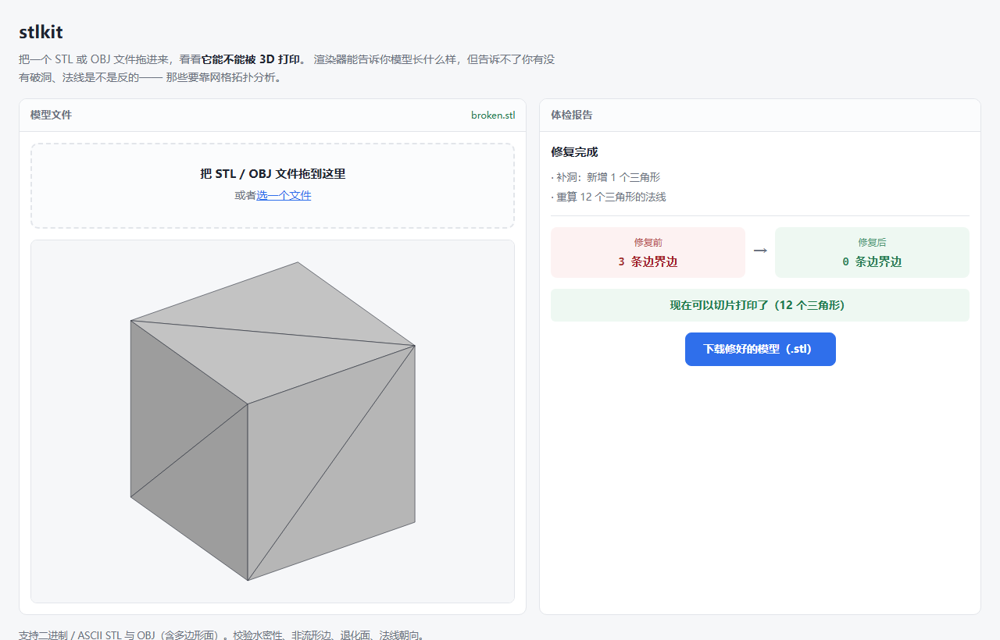

# stlkit

用 MoonBit 写的 STL / OBJ 三维网格工具链。回答一个问题：**这个模型能不能 3D 打印。**

**在线试用：<https://mik1e80.github.io/stlkit/>**


## 为什么需要它

3D 打印失败，最常见的原因不是打印机，是**模型本身有问题**：

| 网格的问题 | 打印时会发生什么 |
| --- | --- |
| 不水密（有破洞） | 切片软件分不清哪是实心哪是空的，算出来的填充是错的 |
| 有非流形边（一条边被三个以上的面共用） | 切片软件不知道该往哪一侧填材料 |
| 有退化面（三个点共线） | 算出零面积的层，产生碎片 |
| 法线朝向反了 | 有的工具会把内外面画颠倒 |

**渲染器能告诉你模型长什么样，但告诉不了你有没有破洞。** 那要靠网格拓扑分析——数清楚每条边被几个面共用。这个工具就是干这件事的。

而且这些问题肉眼看不出来：一个缺了一个三角形的立方体，看上去还是完完整整一个立方体，但它的体积已经从 1 变成 0.833 了——因为体积是靠各面的有符号体积正负抵消算出来的，有破洞就抵消不干净。


## 能做什么

```
解析    STL（ASCII + 二进制）、OBJ（含多边形面与负数编号）、3MF（含装配体与单位换算）
校验    水密性、非流形边、退化面、法线朝向
分析    体积、表面积、包围盒、尺寸、三角形数与去重顶点数
预览    等轴测 SVG 图（自带背面剔除与明暗）
修复    删退化面、去重复面、补洞、重算法线；可导出成 STL 或 OBJ
流式    分块扫描超大模型，内存不随模型大小增长
形态    库 + 命令行 + 网页
```

## 用法

### 网页

拖一个 STL 或 OBJ 文件进页面，左边出预览图，右边出体检报告。**全程在浏览器里完成，文件不会上传到任何地方。**

页面上的分析逻辑不是 JavaScript 重写的，而是同一份 MoonBit 代码经 `moon build --target js` 编译出来的。

### 命令行

```bash
# 出一份体检报告
moon run cmd/main examples/cube.stl

# 顺便导出预览图
moon run cmd/main examples/cube.stl --svg cube.svg

# 跑基准测试，对比三种解析方式的耗时与内存
moon run cmd/main big.stl --bench

# 不带参数打印帮助
moon run cmd/main
```

输出长这样：

```text
examples/broken.stl
  格式      ASCII STL
  三角形    11 个
  顶点      33 个（去重后 8 个）
  包围盒    1 × 1 × 1 mm
  体积      1 mm³
  表面积    5.5 mm²

  ✗ 不是水密网格 —— 有 3 条边只被一个面共用
    网格上有破洞，切片软件分不清哪里是实心哪里是空的，直接打印会失败

  结论：直接打印会失败，需要先修复
```

把错误写清楚是刻意的：看到「有 3 条边界边」的人不知道这意味着什么，看到「切片软件分不清哪里是实心哪里是空的」才知道要修。

### 库

```moonbit nocheck
let data = @fs.read_file_to_bytes("model.stl")
let mesh = match @stlkit.parse_mesh(data) {
  Ok(mesh) => mesh
  Err(msg) => { println("读不了：\{msg}"); return }
}
let check = @stlkit.validate_default(mesh)
if check.is_watertight() {
  println("可以打印，体积 \{mesh.volume()} mm³")
} else {
  println("有 \{check.boundary_edge_count} 条边界边，需要先修复")
}
```

## 3MF：现代切片软件用的格式

STL 是 1987 年的格式，除了三角形什么都没有。**3MF 是它的正式替代品**——PrusaSlicer、
Bambu Studio、Cura 导出的都是它。它和 STL 有两处根本不同：

1. **它是个 ZIP 包**（OPC 容器），模型数据装在里面一个叫 `3D/3dmodel.model` 的 XML 里
2. **顶点是共享的**，三角形存的是顶点表下标，和 OBJ 一样

第二点对「能不能打印」特别重要：**拓扑关系是现成的**。STL 里「哪些三角形共用同一个
顶点」必须靠容差去猜，猜错就把水密性判错了；3MF 直接写着下标，不存在猜的可能。

### 实测：拿官方样例验算

3MF Consortium 的官方样例库拿来跑，结果能和数学对上：

| 文件 | 三角形 F | 边 E = 3F/2 | 顶点 V | V − E + F | 应该是 |
| --- | --- | --- | --- | --- | --- |
| `box.3mf` | 12 | 18 | 8 | **2** | 2（球面） |
| `torus.3mf` | 2200 | 3300 | 1100 | **0** | 0（圆环面） |

闭曲面满足欧拉示性数 V − E + F = 2 − 2g。两个样例**分毫不差**。这同时验证了
顶点表下标没读错、容差焊接没焊错、水密性判断是对的——下标只要偏一位，
这几个数立刻就崩。

`box.3mf` 的包围盒是 10 × 20 × 30，体积算出来是**正好 6000**。

### 装配体

3MF 的对象可以由别的对象拼出来，各带一个 4×3 的变换矩阵：

```xml
<object id="2" type="model">
  <components>
    <component objectid="1" transform="1 0 0 0 1 0 0 0 1 10 0 0"/>
  </components>
</object>
```

矩阵用的是**行向量**约定，12 个数按行排，平移在**最后三个**（第 9/10/11 个）：

```text
m00 m01 m02
m10 m11 m12
m20 m21 m22
m30 m31 m32      ← 平移在这里，不是前三个
```

装配链上组件自己的变换要先做、再套外层的，顺序反了位置就错了。这两个点都是
写的时候最容易搞混的地方，各配了一个测试专门盯着。

对象还能互相引用成环——坏文件里真会出现，所以递归有 32 层上限，不然会栈溢出。

### 官方样例自己就有缺陷

`examples/cube_gears.3mf` 跑出来：

```text
  ✗ 有 53 个面的绕向和其他面相反（顶点顺序写反了）
  ✗ 有 24 条边被三个以上的面共用（非流形边）
  ✗ 有 24 个退化三角形（三个点共线，没有面积）
```

这不是解析器出错：该文件是 17 个对象各带一个纯平移拼起来的、**没有任何
`<component>`**，所以对象引用和矩阵合成那两块代码根本不参与；其余三个官方样例
都报水密零缺陷；53 个反向面只占 25692 的 0.2%，是局部现象而不是整体崩坏。

**一个格式官方提供的样例模型，看起来完全正常，实际有 24 个退化面**——
渲染器画出来一点问题都没有，切片的时候才会出问题。这正是这个工具存在的理由。

## 超大模型：流式解析

### 问题出在内存，不是速度

一个三角形在**文件里**和**内存里**的大小差三倍：

| | 组成 | 大小 |
| --- | --- | --- |
| 文件里（二进制 STL） | 3 个坐标 + 1 个法线 = 12 个 float32 | 50 字节 |
| 内存里（`Triangle`） | 4 个 `Vec3` = 12 个 `Double` | 96 字节 |

解析一个 480 MB 的模型，光是「把三角形存下来」就要再吃掉 900 MB 以上。加上文件本身，一个不到 500 MB 的文件能顶到 1.5 GB。

**这不是渲染库没做优化。** Three.js 这类库必须把顶点留下来——它们的顶点最终要上传到 GPU，存下来是结构性的。但**做统计不需要存**：体积、表面积、包围盒都能一边读一边累加，读完就扔掉。

### 做法

`StlScanner` 是一个可以反复喂数据块的状态机，内部只留三样东西：

1. **没凑够一个完整记录的零头**——块的大小随便给，不要求对齐到 50 字节
2. **顶点去重表**——只存「量化坐标 → 编号」，8 字节一个键，不存三角形
3. **边表**——每条边压成一个 `UInt64`（两个端点编号各占 32 位）

统计水密性需要知道「每条边被几个面共用」，这是唯一躲不掉拓扑的地方。实现上是**收集完边之后排序再扫一遍**，而不是用哈希集合：同一个 `UInt64` 在哈希表里要占 30~50 字节（键 + 值 + 桶 + 装载因子），1500 万条边就是 400 MB 以上；紧凑数组里只要 120 MB。

文件读取走 `moonbitlang/async/fs` 的 `read_at`，256 KB 一块循环复用——**整个过程中文件不进内存**，缓冲区大小是固定的，文件再大也不会变大。

### 实测

`/c/tmp/huge.stl`，95.37 MB，200 万个三角形：

```bash
$ moon run cmd/main huge.stl --bench
  全量解析（保留网格，能校验能修复）
    耗时      18087.6 ms
    内存      文件 95.37 MB + 网格 198.36 MB = 293.73 MB

  流式扫描（不保留网格，文件整块读）
    耗时      2048.4 ms
    内存      文件 95.37 MB + 顶点边表 45.85 MB = 141.22 MB

  流式扫描（不保留网格，文件分块读）
    耗时      3334.3 ms
    内存      缓冲 256 KB + 顶点边表 45.85 MB = 46.1 MB

  省内存      247.63 MB（84.3%）
  提速        5.4 倍
```

摊到每个三角形上：全量 **154 字节**，分块流式 **24 字节**——少了 6.4 倍。

内存数字是按各自需要的数据结构**算出来**的，不是读操作系统的进程占用：wasm 的线性内存按页预留和增长，直接看进程 RSS 不准。公式写在 `full_memory` / `stream_memory` 的注释里，可以核对。

### 两条路径必须给出同样的结论

快而错没有意义。所以 `--bench` 内置了交叉验证：三条路径（全量解析、整块流式、分块流式）的三角形数和边界边数必须完全一致，对不上就直接报错，不当作基准。`stream_wbtest.mbt` 里也把流式结果的**每个字段**和全量校验逐项对照——两份独立实现，只要体积累加、坐标量化、边打包有任何一个环节写得不一样，结果就会悄悄分叉。

有一项流式**做不到**：绕向一致性。它需要反复遍历邻接面，而流式扫描是单遍的、不保留面与面的关系。所以报告里会明说「流式做不到这项」，而不是假装查过了。

### 两条路怎么选

| | 全量解析 | 流式扫描 |
| --- | --- | --- |
| 体积 / 表面积 / 包围盒 | ✓ | ✓ |
| 水密性 / 非流形边 | ✓ | ✓ |
| 绕向一致性 | ✓ | ✗ |
| 修复、导出、预览 | ✓ | ✗ |
| 内存 | 随模型线性增长 | 固定（分块模式下） |

小文件走全量——能多查出绕向问题，还能顺手修复。几百 MB 的扫描件走流式——先知道「有没有破洞」往往就够了。

## 实现上的几个决定

**坐标一律用 `Double`，即使 STL 二进制里存的是 32 位浮点。** 体积求和是几十万项累加，用 32 位会在累加过程里越飘越远。读进来就转双精度，误差只剩原始数据本身的。

**解析阶段不做顶点去重。** STL 每个三角形都把自己的三个顶点重写一遍，一个立方体的 8 个顶点会写 36 遍。但「文件里有多少重复顶点」本身就是一条要报告的校验信息，而且浮点去重涉及「多少算同一个点」的容差问题，不该混进解析。

**格式判断靠内容不靠扩展名。** 从别处拷来的文件经常带着错的扩展名，而且二进制 STL 根本没有可靠的文本特征。做法是先按二进制试——从第 80 字节读三角形数量，如果 `84 + 数量 × 50` 正好等于文件长度，那就是二进制；对不上再按文本关键字找。

**顶点焊接按容差量化坐标。** 这是「两个顶点算不算同一个点」的答案：把每个坐标除以容差（默认 1e-6 毫米，也就是 1 纳米）再四舍五入，落在同一格的就算同一个点。这样把浮点比较换成整数比较，避开「0.1 + 0.2 != 0.3」这类问题。1 纳米的容差能盖住 32 位浮点的重复顶点误差，又远小于任何有意义的建模特征（打印机精度是 0.1 毫米量级）。

**预览用画家算法，不是 Z-buffer。** 每个三角形投影到屏幕，按离眼睛的远近排序，远的先画近的后画。对凸的、不怎么自遮挡的模型够用——3D 打印模型基本都属于这类。真正准确的消隐要上光栅化，对这个项目是杀鸡用牛刀。

**法线一律自己算，不用文件里写的。** 很多导出器写的法线是错的甚至直接填 `0 0 0`。校验时会拿文件里的和按顶点顺序算出来的比，不一致就报出来；但渲染和分析时一律用自己算的。

## 开发

仓库根目录就是 MoonBit 模块根：

```bash
moon test            # 跑测试
moon run cmd/main    # 不带参数会打印帮助
bash web/build.sh    # 重新编译网页用的 JS
```

网页部分由 GitHub Actions 自动发布，见 [`.github/workflows/pages.yml`](.github/workflows/pages.yml)。

### 测试

实测结果：

```text
Total tests: 145, passed: 145, failed: 0.
```

`moon check --target all --deny-warn` 零警告。

测试的手法统一是「**拿一个正确的立方体，故意弄坏它，看能不能查出来**」——一个查不出问题的校验器等于没有，所以每条检查都配了反例：

- 拿走 1 个三角形要报 3 条边界边，拿走一整个面要报 4 条
- 三个面共用一条边要报非流形
- 翻转法线要被抓到，但法线填零不算错（那是「没填」不是「填错了」）
- 容差两侧各测一次：差 1e-9 的要焊成一个点，差 0.001 的不能
- OBJ 走的是完全不同的代码路径（查顶点表、扇形三角化），但算出来的体积必须和 STL 版一致
- 流式扫描的每个字段都和全量校验逐项对照，分块扫描还要用 1、3、7、13、49、51、83、85 字节这些**不对齐**的块大小各跑一遍——实现里只要假设了「每次喂进来的都是完整记录」，这些尺寸立刻算出垃圾
- 3MF 的测试样本**在内存里现拼**（用 fzip 的 `zip_sync` 把几段 XML 打成 ZIP），想改哪一处就改哪一处。除了正常路径，还专门盯了几个易错点：英寸/厘米/米的换算（不换算体积差 16387 倍）、矩阵平移在**最后三个数**而不是前三个、组件变换和 build 变换的叠加顺序、以及对象互相引用成环时不能栈溢出

单位立方体是整套测试的基准：12 个三角形，体积必然是 1、表面积必然是 6、包围盒必然是 1×1×1。任何一个环节算错，这几个数就对不上。

### 依赖

解析 STL / OBJ 和全部几何分析**只用 MoonBit 自带的核心库**（`core/string`、`core/math`、`core/encoding/utf8`），没有第三方依赖。

3MF 支持引入两个库：`hustcer/fzip`（解 ZIP）和 `Milky2018/xml`（解 XML）。不自己造是因为
这两件事的坑都很深——ZIP 要写 inflate，还得防 zip bomb；XML 的实体、命名空间、属性引号
一个都不能漏。`fzip` 自带解压比检查和路径安全检查，解析陌生人传上来的文件正需要。

**两者都是纯 MoonBit、没有 FFI**，所以 native / wasm / js 三端都能跑这条不受影响。
代价是网页产物从 334 KB 涨到 770 KB。

命令行包另外引入 `moonbitlang/x`（读文件、设退出码）、`core/argparse`（参数解析）
和 `moonbitlang/async`（分块读文件，只有 `--bench` 用）。

## 项目结构

- `vec3.mbt` — 三维向量与点乘/叉乘/单位化
- `mesh.mbt` — Triangle / Aabb / Mesh，以及体积、表面积、包围盒
- `stl.mbt` — STL 解析（两种形态）与格式判断
- `obj.mbt` — OBJ 解析（共享顶点表、多边形三角化、负数编号）
- `three_mf.mbt` — 3MF 解析（ZIP + XML、装配体、单位换算）
- `validate.mbt` — 顶点焊接与四项校验
- `winding.mbt` — 绕向一致性检查与统一
- `repair.mbt` — 补洞、删退化/重复面、统一绕向、重算法线
- `writer.mbt` — 导出二进制 / ASCII STL 与 OBJ
- `preview.mbt` — SVG 等轴测渲染
- `stream.mbt` — 流式扫描（不建网格、分块读取，内存不随模型增长）
- `cmd/main/` — 命令行
- `web/` — 网页版（含编译产物 `dist/web.js`）
- `examples/` — 演示与测试用的模型：完好、破洞、绕向反了、圆环，STL 与 OBJ 各一份

## 修复

`--fix` 把网格修一遍再存出去。支持四项：删退化面、删重复面、**补洞**、重算法线。

```bash
moon run cmd/main examples/broken.stl --fix fixed.stl
```

```text
  修复前 边界边 3  非流形边 0  退化面 0
  修复后 边界边 0  非流形边 0  退化面 0

  已存到 fixed.stl（684 字节），现在可以切片打印了
```

导出格式按文件名后缀选：`.stl` 出二进制 STL，`.obj` 出 OBJ。这是全项目**唯一**一处看扩展名的地方——别处判断输入格式都看内容，因为导出必须由用户指定格式，同一个网格两种都能写，没有内容可看。

补洞是最有价值的一项，也最容易出错：**新补的三角形绕向必须和原来的面一致**。原来的面里有一条边 `a→b` 只被一个面用到，新补的三角形就得用 `b→a`，这条边才会变成「被两个面以相反方向共用」，也就是水密。方向搞反的话补完还是不通。

洞的形状可能是凹多边形，所以补法是「环中心 + 环上相邻两点」而不是直接扇形三角化——直接扇形会补出翻到实体外面的三角形。三角形的洞（三个顶点）例外，直接补一个三角形，不用加中心点。

修完会重新跑一遍校验，把修复前后的边界边数对照着打出来。只报「修复完成」没法让人判断到底修好了没有，显示「边界边 3 → 0」才叫证据。

网页版上也有这个按钮：**有问题才会出现**（没问题的模型给个按钮反而让人以为要修什么），点一下就地修好、更新预览、给一个下载链接。



### 绕向：水密检查查不出的那种坏

有一类坏数据**藏得很深**：某个面的顶点顺序写反了。它仍然是「每条边恰好被两个面共用」的闭合曲面——水密性检查说没问题；按它自己的顺序重算法线也是**自洽的**——法线检查也说没问题。但那个面朝里了，体积求和时它的贡献符号反了：

```
$ moon run cmd/main examples/flipped.stl
  体积      0.667 mm³        ← 错！应该是 1

  ✗ 有 1 个面的绕向和其他面相反（顶点顺序写反了）
    这些面朝里了：水密性检查看不出问题，但体积会算错，切片软件也可能把实心区域填反
  ⚠ 有 1 个三角形的法线朝向和顶点顺序不一致
```

查它的办法是从一个面出发做广度优先遍历，沿共享边往外推：相邻的两个面必须**以相反方向**使用它们共用的那条边。顺藤摸瓜就能给每个面定下朝向，跟主体不一致的就是写反的。

修的时候要注意顺序——**统一绕向必须排在重算法线之前**：绕向一变法线也跟着变，反过来做的话刚算好的法线会被绕向翻转作废。

还有一步不能省：遍历只能保证「互相一致」，保证不了「朝外」。一个整体朝里的网格所有面都是一致的，但体积是负的。所以遍历完还要看有符号体积的正负，为负就把全体翻一遍。

```
$ moon run cmd/main examples/flipped.stl --fix fixed.stl
修复：
  翻转 1 个绕向反了的面（体积从 0.667 修正为 1）
  已存到 fixed.stl（684 字节），现在可以切片打印了
```

实现上踩了两个坑，都记在 `winding.mbt` 的注释里：

1. **相邻面的方向必须跟当前面比，不能跟边的规范顺序比**。拿规范顺序比会得到「所有面都和规范顺序一致」这种恒真的结论，规则直接失效。
2. **同一条边的两个面都要留着**。绕向反了的那条边上，两个面走的是**同一个方向**——只存「谁走了这个方向」的话，后写入的会覆盖先写入的，查找时还会返回自己。

## 许可证

Apache License 2.0，见 [LICENSE](LICENSE)。
